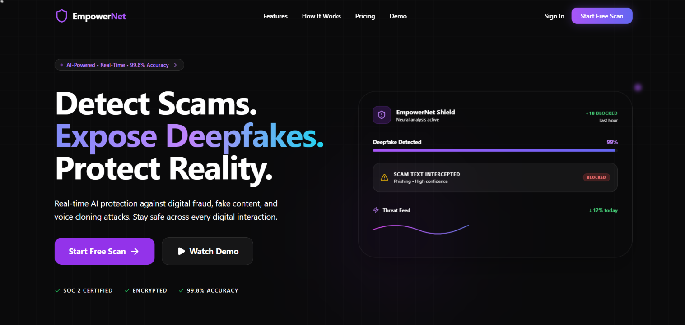
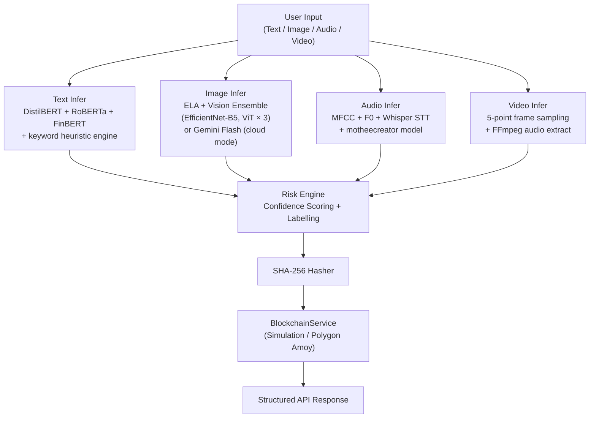
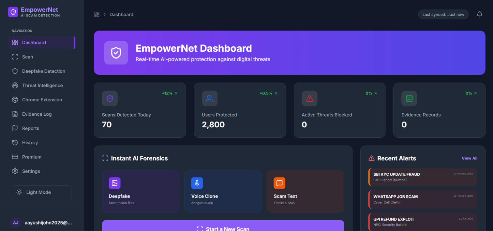
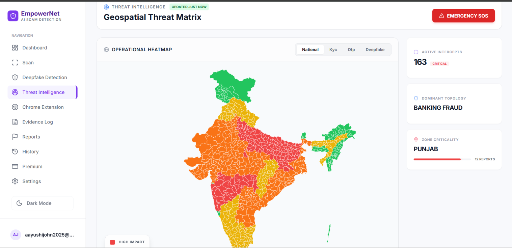

<div align="center">



# EmpowerNet AI

**Multi-modal deepfake & scam detection for browsers, video calls, and digital media.**

[](https://python.org)
[](https://fastapi.tiangolo.com)
[](https://reactjs.org)
[](https://typescriptlang.org)
[](LICENSE)
[](https://drive.google.com/file/d/1N0-l76tcmqyVLoJneCnO7WZ6s42YjIZt/view?usp=sharing)

</div>

---

## Overview

EmpowerNet AI is a full-stack forensic intelligence platform designed to detect AI-generated scams, deepfakes, voice cloning, and synthetic media across text, images, audio, and video.

It combines a React dashboard, FastAPI backend, Chrome Extension, machine learning inference pipelines, and a cryptographic evidence ledger into a unified workflow for digital threat analysis.

> **Blockchain note:** The evidence ledger generates a deterministic SHA-256 proof hash for every scan and stores it in a persistent local log. It is architected to submit transactions to Polygon Amoy when `PRIVATE_KEY` and `CONTRACT_ADDRESS` are configured — currently running in **local simulation mode** by default.

---

## Features

| Area | Capability |
|------|-----------|
| 🔍 **Multi-modal Scanning** | Text, Image, Audio, and Video deepfake/scam detection |
| 🌐 **Browser Extension** | Real-time protection on any webpage (Chrome Manifest V3) |
| 🎭 **Deepfake Detection** | Vision ensemble (EfficientNet-B5, ViT, Organika/sdxl-detector) |
| 🎙️ **Voice Clone Detection** | MFCC + F0 analysis + optional Whisper STT |
| ⛓️ **Evidence Ledger** | SHA-256 proof hashing, Polygon Amoy-ready (simulation mode default) |
| 📄 **Forensic Reports** | PDF export + direct submission workflow to cybercrime.gov.in |
| 🛡️ **Meeting Shield** | Real-time frame + audio analysis for Google Meet / Zoom |
| 👁️ **Social Media Scanner** | Profile image and post content analysis |
| 👶 **Child Safety** | NSFW and cyberbullying content filtering |

---

## Architecture

```mermaid
flowchart LR
    subgraph Clients
        A[React Dashboard]
        B[Chrome Extension]
    end

    subgraph Backend["FastAPI Backend (port 8001)"]
        C[/api/scan]
        D[/realtime/video]
        E[/realtime/audio]
        F[/analyze/*]
    end

    subgraph ML["ML Inference Layer"]
        G[Text Pipeline]
        H[Image Pipeline]
        I[Audio Pipeline]
        J[Video Pipeline]
    end

    subgraph Evidence["Evidence Ledger"]
        K[SHA-256 Hasher]
        L[Blockchain Service\nSimulation / Polygon Amoy]
    end

    A --> Backend
    B --> Backend
    C --> ML
    D --> J
    E --> I
    F --> ML
    ML --> Evidence
    Evidence --> Backend
```

### ML Pipeline Detail



---

## Tech Stack

| Category | Technologies |
|----------|-------------|
| **Frontend** | React 18 · TypeScript · Vite · Tailwind CSS · Zustand · Framer Motion |
| **Backend** | FastAPI · Python 3.10+ · Uvicorn · Pydantic v2 |
| **ML — Vision** | PyTorch · HuggingFace Transformers · EfficientNet-B5 · ViT (×3) · OpenCV · MediaPipe |
| **ML — Audio** | Librosa · Whisper-Tiny · motheecreator/Deepfake-audio-detection |
| **ML — Text** | Fine-tuned transformer · unitary/toxic-bert · ProsusAI/FinBERT · Keyword heuristic engine |
| **Evidence Ledger** | SHA-256 · web3.py · Solidity · Polygon Amoy Testnet *(simulation mode default)* |
| **Browser Extension** | Chrome Manifest V3 · Service Worker · Offscreen API |
| **Deployment** | Docker · Railway · Vercel |

---

## Project Structure

```
EmpowerNet-AI/
├── backend/
│   ├── api/
│   │   └── routers/        # Modular FastAPI route handlers
│   │       ├── scan.py
│   │       ├── realtime.py
│   │       └── websocket.py
│   ├── blockchain/         # Evidence ledger (simulation-ready Polygon Amoy)
│   ├── config/             # Centralized settings (Settings class)
│   ├── ml/                 # Inference pipelines per modality
│   │   ├── text_infer.py
│   │   ├── image_infer.py
│   │   ├── audio_infer.py
│   │   ├── video_plus_infer.py
│   │   ├── ml_service.py   # Vision ensemble + real-time video/audio
│   │   └── child_safety.py
│   ├── models/             # Pydantic request/response schemas
│   └── main.py             # App entrypoint — registers all routers
│
├── frontend/
│   ├── pages/              # React page components
│   ├── services/           # API client (fetch wrappers)
│   └── store/              # Zustand global state
│
├── empowernet-extension/   # Chrome Extension (Manifest V3)
│   ├── background.js
│   ├── content.js
│   ├── popup.html / popup.js
│   └── manifest.json
│
├── docs/                   # Architecture diagrams and documentation
├── .env.example            # Environment variable template
├── Dockerfile              # Production Docker image (Railway)
├── CONTRIBUTING.md
├── SECURITY.md
└── CHANGELOG.md
```

---

## Run Locally

### Prerequisites

- Python ≥ 3.10
- Node.js ≥ 18.x

### Backend

```bash
cd backend
pip install -r requirements.txt

# Copy and populate environment variables
cp ../.env.example ../.env

uvicorn main:app --reload --port 8001
```

### Frontend

```bash
cd frontend
npm install
npm run dev
# → http://localhost:3001
```

### Chrome Extension

1. Open `chrome://extensions`
2. Enable **Developer mode**
3. Click **Load unpacked** → select the `empowernet-extension/` directory

---

## Environment Variables

```env
# ML Configuration
LOAD_MODELS=false          # Set to true to enable local heavy models (GPU recommended)
GEMINI_API_KEY=            # Required for cloud vision inference when LOAD_MODELS=false

# Evidence Ledger — leave blank to use simulation mode (default)
POLYGON_RPC_URL=https://rpc-amoy.polygon.technology/
PRIVATE_KEY=               # Optional: Polygon wallet private key
CONTRACT_ADDRESS=           # Optional: Deployed EvidenceRegistry address
```

---

## Screenshots

<p align="center">
  
  
</p>

---

## Contributing

See [CONTRIBUTING.md](CONTRIBUTING.md) for setup instructions, code style guidelines, and the pull request process.

## Security

See [SECURITY.md](SECURITY.md) for the vulnerability reporting process and security disclosures.

## License

This project is licensed under the **MIT License** — see [LICENSE](LICENSE) for details.
